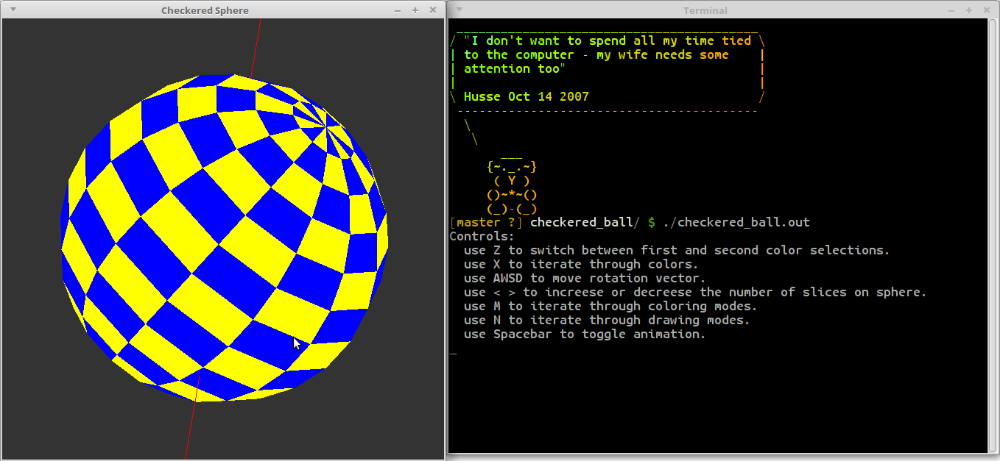
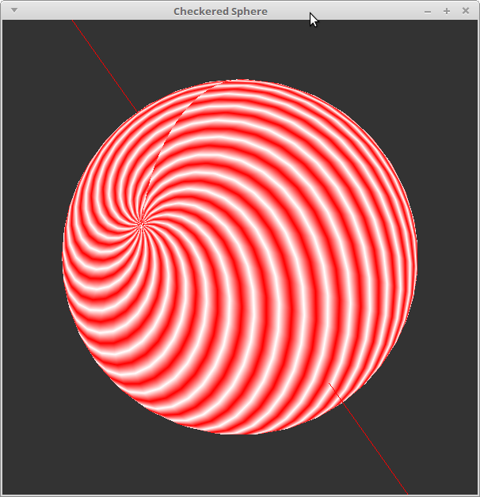
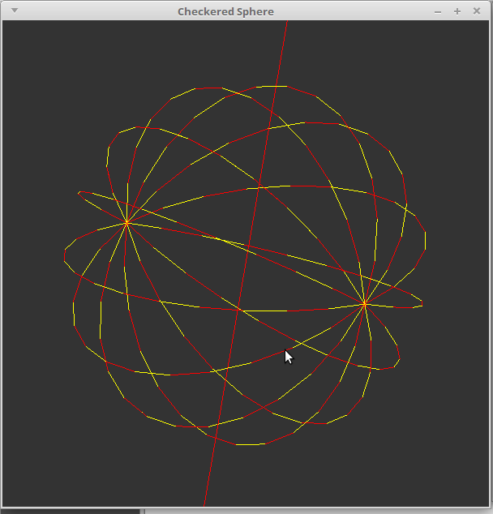

# Checkered ball

There's a `makefile` included that uses `g++` you can use it to build the project

```
$ make
```

run the program in a terminal. Instructions on how to use are written in the command line.






