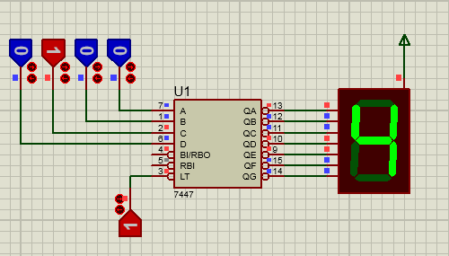

# Drive a common anode 7-segment with 7447

The main purpose of this experiment was to get acquinted to the design software.

We used a [7447 *BCD to 7segment converter*](http://www.ti.com/lit/gpn/sn5447a) to display BCD numbers (0 to 9) on a common anode 7-segment. 

- [Proteus circuit file](7segment_and_7447.pdsprj)

