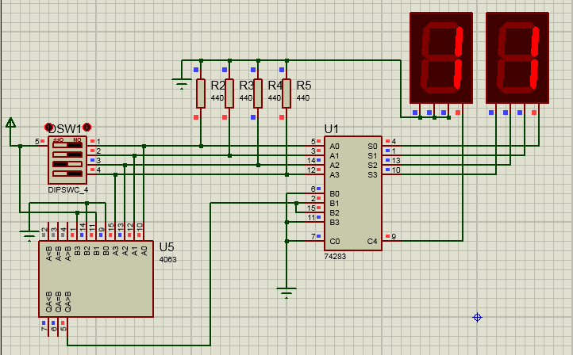

# 4-bit binary input to dual 7-segment decimal display

The purpose of this experiment is to find a way to convert a 4-bit binary number to multiple Binary Coded Decimals.

We used a [4063 *4-bit magnitude comparator*](http://www.edutek.ltd.uk/Binaries/Datasheets/4000/HCF4063.pdf) to detect binary numbers greater than 9 and light up 1 on tens digit. A [74283 *4-bit binary adder*](http://www.ti.com/lit/ds/symlink/sn74ls283.pdf) then adds 6 to the binary number to calculate the ones digit.

- [Proteus circuit file](4bit-dual_digit_7segments.pdsprj)

