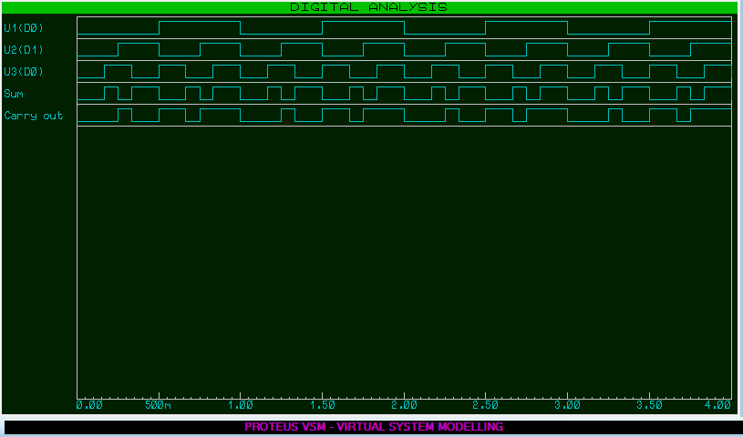

# Making a Full Adder using logic gates

We learn to use Probes, Function generators, and DC Sweep in this experiment.

Utilizing basic logic gates, we made a full-adder and used paulse generators to feed the input. We used probes on the outputs. A DC-sweep then shows all the inputs and outputs on a time-voltage graph. 

We inspect the graph and see it works as intended.

- [Proteus circuit file](full_adder.pdsprj)

