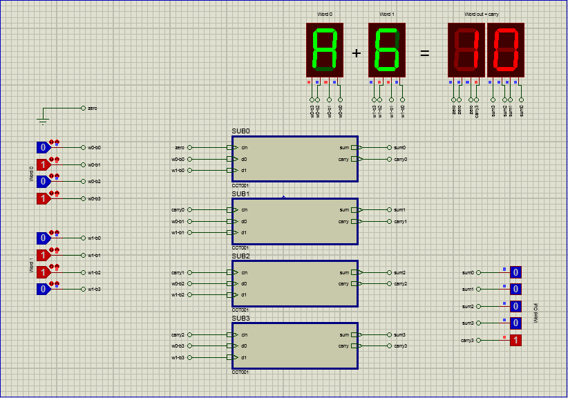

# 4-bit Adder made with 4 Full Adder subcircuits

We learn how to make subcircuits and terminals to simplify our circuit design and keep it modular and managable.

- [Proteus circuit file](4bit_adder.pdsprj)

