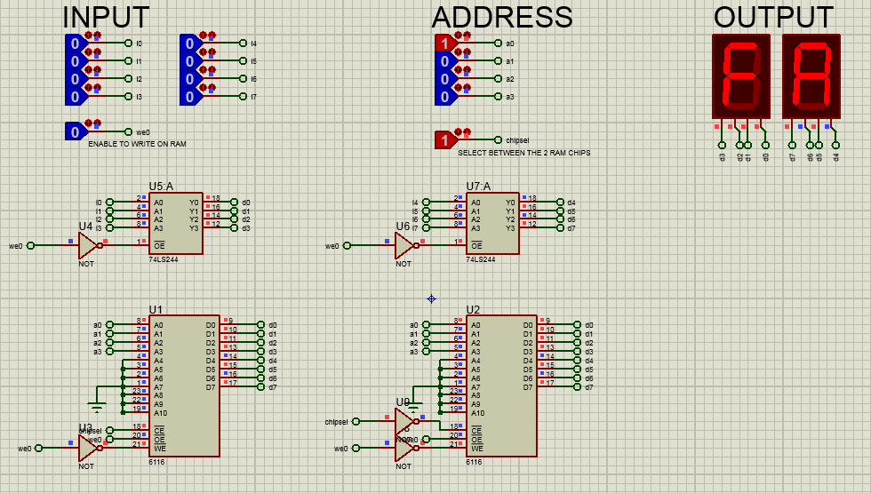

# RAM to store data

On this circuit we have:

- 8 logic-states to feed values to the RAMs to store (INPUT) 
- 4 logic-states to address the RAMs (ADDRESS) 
- One logic state to enable writing on RAM (WE0) 
- One logic-state to select between the 2 RAM chips on the circuit (CHPSEL) 

- [Proteus circuit file](RAM.pdsprj)

