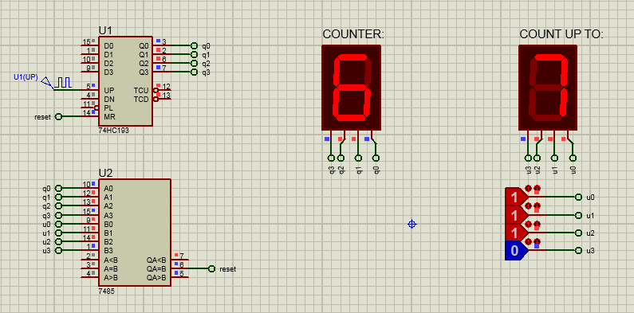
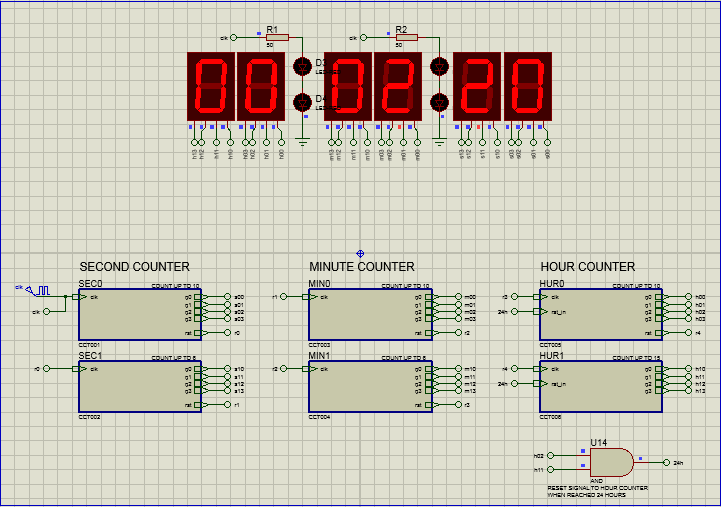

# Decade counter

- [Proteus circuit file](decade_counter.pdsprj)

# Binary counter

- [Proteus circuit file](binary_counter.pdsprj)

# 24-hour clock

- [Proteus circuit file](24hour_clock.pdsprj)

